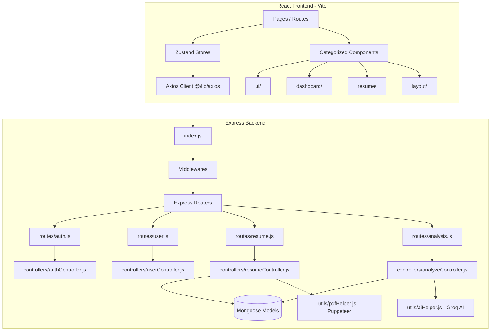

# System Architecture & Codebase Directory Map

Welcome! This document provides a complete guide to the architecture, directory layout, design patterns, and engineering best practices established in this repository. It is designed to serve as an onboarding map and a blueprint for code reviews.

---

## 🏗️ Architecture Overview

The system is designed as a modular, decoupled **Client-Server web application** consisting of a React + Vite frontend and an Express (Node.js) backend.



---

## 📂 Directory Layout

### 1. Client Architecture (`client/`)

The frontend is structured to keep UI concerns isolated from page routes and state logic.

```
client/
├── jsconfig.json            # IDE support for absolute imports (@/*)
├── vite.config.js           # Vite build tool and absolute path alias configuration
├── src/
│   ├── main.jsx             # React entry point, Toaster & React Query setup
│   ├── App.jsx              # Main Router, Protected Routing & global layout
│   ├── index.css            # Global CSS styling system
│   ├── components/          # Reusable categorized components
│   │   ├── ui/              # Low-level generic presentation components (ThemeToggle, Modals, Progress)
│   │   ├── layout/          # Page wrapping and navigation layout components (ProtectedRoute)
│   │   ├── dashboard/       # Metrics, score widgets, and dashboard features (AITokenMeter, ATSScoreMeter)
│   │   └── resume/          # Resume interactive elements (ResumePreview, VersionHistory, Suggestions)
│   ├── pages/               # Top-level Page elements corresponding to URL routes (Dashboard, Builder, Analyze)
│   ├── stores/              # State management powered by Zustand (authStore, resumeStore, themeStore)
│   └── lib/                 # Core API / Clerk configuration clients (axios, clerkTheme)
```

### 2. Server Architecture (`server/`)

The backend follows a classic **Layered Architecture (MVC)** pattern ensuring separation of concerns:

```
server/
├── index.js                 # Server entry point, DB connectivity, error-handling & middleware mounting
├── routes/                  # Express routers mapping endpoints to middlewares & controllers
│   ├── auth.js              # Authentication sync and login routes
│   ├── user.js              # Profile management & security settings
│   ├── resume.js            # Pure resume CRUD, visibility & versioning actions
│   └── analysis.js          # Dedicated router for resume ATS scans, audits, and reports
├── controllers/             # Business logic handlers processing requests and returning responses
├── models/                  # Mongoose MongoDB schemas representing data documents
├── middleware/              # Express middlewares (authentication guards, rate-limiters, uploaders)
├── validators/              # Input schema validation utilizing express-validator
├── utils/                   # Shared utility modules (Groq AI, PDF generators, Winston logger, email templates)
└── __tests__/               # Jest integration and unit test suite
```

---

## 💎 Engineering Best Practices

### 1. Absolute Imports (`@/*`)
To avoid messy and brittle relative paths like `../../../stores/authStore`, the project utilizes a Vite absolute path alias pointing `@` directly to `client/src/`.
* **Standard practice**: Always import using `@/` in client code.
* **Example**: `import useAuthStore from '@/stores/authStore';`

### 2. Single Responsibility Principle (SRP) for APIs
API routers are strictly separated by domain entity. If a new domain feature is created (e.g., subscription payments, template styling), create a separate:
1. Router (`routes/feature.js`)
2. Controller (`controllers/featureController.js`)
3. Validation schema (`validators/featureValidator.js`)
4. Mount it explicitly in `index.js` under `/api/feature`.

### 3. Type-Safe DB Query Inputs (NoSQL Injection Defense)
To prevent NoSQL object injection attacks (e.g., passing nested MongoDB query objects like `{ $ne: "" }` instead of plain strings), all untrusted user parameters derived from `req.body`, `req.query`, or `req.params` **must** be explicitly type-cast to strings before they are used in query filters.
* **Standard practice**: Always wrap raw query parameters with `String(...)` or cast them cleanly:
* **Example**:
  ```javascript
  const emailStr = String(req.body.email).toLowerCase();
  const user = await User.findOne({ email: emailStr });
  ```

### 4. Core Node.js Import Protocol (`node:`)
When importing built-in Node.js core modules (such as `crypto`, `path`, or `fs`), always prefix the module name with the `node:` protocol. This explicitly tells the runtime and developers that it is a native built-in module rather than a potential third-party package from npm.
* **Standard practice**: Prefix core imports with `node:`.
* **Example**: `const crypto = require('node:crypto');`

### 5. ReDoS-Proof Validation and Masking
Avoid utilizing complex, unanchored, or nested greedy quantifiers in regular expressions on user-controlled inputs, which are vulnerable to catastrophic backtracking (Regular Expression Denial of Service - ReDoS).
* **Standard practice**: Replace complex matching and masking patterns with linear O(n) string manipulation methods (like `.includes()`, `.slice()`, or `.split()`), or enforce a strict input length limit (e.g., 254 characters) before running the regex.


---

## 📈 Guide for Adding a New Feature

If you are developing a new feature (e.g., adding "Social Media Import"):

1. **Backend Database Model**: Create a Mongoose schema if new persistent data is needed in `server/models/`.
2. **Backend Logic**:
   - Create a validator in `server/validators/`.
   - Implement the business logic handler in `server/controllers/`.
   - Define and map the endpoints in a router under `server/routes/`.
   - Register the router in `server/index.js`.
3. **Frontend State**: Add state hooks or a new Zustand store in `client/src/stores/`.
4. **Frontend UI Component**:
   - If it's a reusable UI element, add it to `client/src/components/ui/`.
   - If it's specific to a dashboard feature, put it in `client/src/components/dashboard/`.
   - Connect it to the API using `@/lib/axios` requests.
5. **Add Tests**: Put an integration test in `server/__tests__/` to verify the logic.
